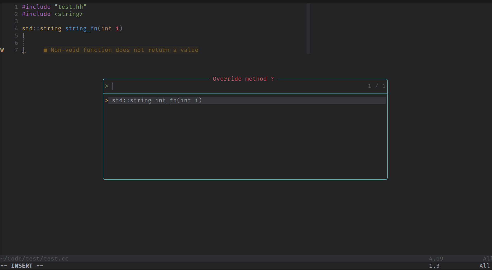
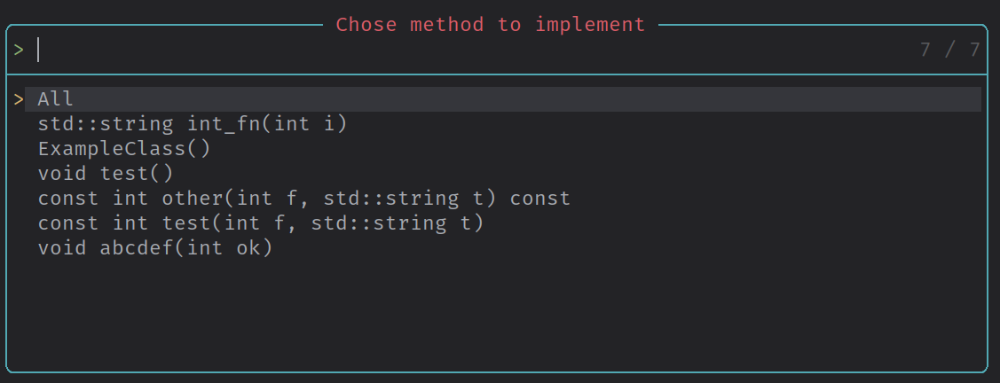

# Overview

cpp-tools.nvim is a plugin that aims to keep header and source files synchronized among cpp-projects.




# Configuration

Example of configuration using lazy:

```
return {
    "Frayzen/cpp-tools.nvim",
    config = function()
        require("cpp-tools").setup()
        require("which-key").register({
            ["<Leader>t"] = {
                name = "tools",
                i = {
                    function()
                        require("cpp-tools").implement()
                    end,
                    "Implement",
                },
                r = {
                    function()
                        require("cpp-tools").refactor()
                    end,
                    "Refactor",
                },
            },
        })
    end,
    dependencies = {
        "nvim-treesitter/nvim-treesitter",
        "nvim-lua/plenary.nvim",
    },
}
```
